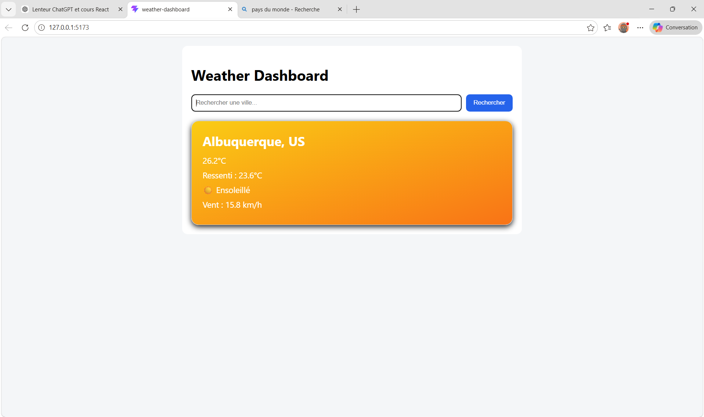

# Weather Dashboard

Application météo développée avec React et Vite.

## Fonctionnalités

- Recherche de ville
- Données météo en temps réel avec Open-Météo API
- Température actuelle
- Température ressentie
- Vent
- Description météo
- Icônes météo dynamique
- Fond dynanique selon la météo
- Gestion des erreurs
- État de chargement

## Technologies utilisées

- React
- Vite
- JavaScript
- CSS
- Open-Meteo API

## Screenshot

## Installation

``bash
npm install
npm run dev

## Auteur

Joseph Maro
